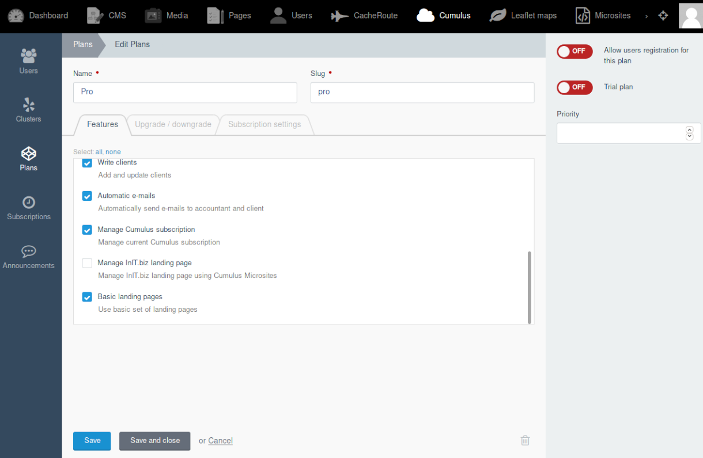
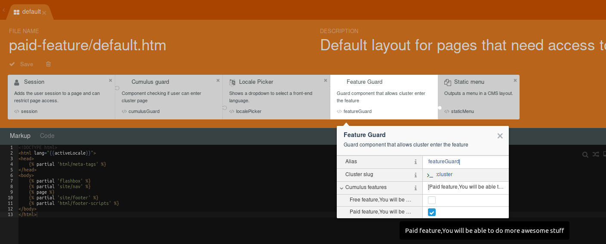

# Cumulus Core - create a SaaS (multi-tenant) application in OctoberCMS


This is the Cumulus Core plugin for OctoberCMS by [InIT.biz](https://init.biz).

## Introduction

This powerful plugin provides the base framework that enables you to build a multi-tenant SaaS application within October by using additional plugins from the Cumulus family as you require them.

Examples where Cumulus may help include:

-   Creating a system for clients that securely stores private data in the cloud (your server) which is only available to logged in users. An invoicing or client management system, would be an example of two types.
-   A system for schools where classes can share approved data held in the database but be restricted from sensitive or classified data such as examinations and reports.
-   Any subscriber service system that supports bespoke functionality dependant on tiered, paid plans model ( "Free", "Plus", "Pro", etc.)

## Installation

You can install Cumulus in the following ways:

1. from [OctoberCMS Marketplace](https://octobercms.com/plugin/initbiz-cumuluscore),
1. clone the code from [GitHub repo](https://github.com/initbiz/oc-cumuluscore-plugin) into `/plugins/initbiz/cumuluscore` directory,
1. install using Composer `composer require initbiz/oc-cumuluscore-plugin`,

### TL;DR

If you want to play with Cumulus right away, visit [cumulus.init.biz](https://cumulus.init.biz) or [cumulus.init.biz/backend](https://cumulus.init.biz/backend)
for backend view.

> In frontend there's a user `demo@init.biz` with password `demo@init.biz`
>
> In backend there's a user `demo` with password `demo`

## Terms explanation

### Frontend user / User

Frontend users are managed by `RainLab.User` plugin. They can log in to your application and in most cases, they will be your clients' accounts. See [RainLab.User documentation](https://octobercms.com/plugin/rainlab-user) for more info about this.

By design, your clients' accounts have to have restricted access to the application functionality and data so that they do not see other clients' data (of course if you do not want to).

### Backend user / Admin

Backend users / admins are developers or application owners. By design backend users have access to application panel and places like registered users, their subscriptions, invoices, usage stats and so on.

### Cluster

Clusters are groups of users who share some data between them and can be described as one entity. The most common example is the company but it also applies to offices, office branches, classes in school, schools, etc.

> You can understand clusters as tenants in multi-tenant architecture but remember that, in Cumulus, a user can have access to more than one cluster.

**Clusters are not `usergroup`s from `RainLab.User` plugin (like `guest`, `registered` and so on)**

Clusters add one more abstraction layer between user roles and permissions in the application. This means you can give a cluster a part of the functionality in your system. In Cumulus we use [features](#cumulus-features) to do it.

### Plan

Plans are used to organize sets of Cumulus [features](#cumulus-features) that are given to clusters. A cluster can have only one plan assigned at a time, but a lot of clusters can have the same plan.

The easiest way to get the idea is to imagine an example pricing table with plans like "Free", "Plus" and "Pro".

### (Cumulus) Features

Cumulus Features (or just features) are parts of the whole functionality of our application. Access to them is given to clusters by assigning them to plans. Every plugin of yours can [register its own features](#registering-cumulus-features).



### Clusters' usernames

Clusters' usernames are unique strings to be used in URLs so that URLs can be changed by the client the way they want to. The same feature on Facebook and Twitter is called `username` so we decided to use the name `username` as well.

Using usernames has to be enabled in general Cumulus settings (`using usernames in URLs`). By default, Cumulus will use the cluster's slug.

## Developer guide

Before you proceed, ensure you understand the terms explained [before](#terms-explanation).

### Preparing Cumulus pages

In Cumulus we specify four groups of pages that according to content we provide are:

1. publicly visible, where we put our offer, regulations, contact form, login form, register form, etc.,
1. pages for registered and logged in users, where they can manage their profiles, read messages, select cluster they want to enter, etc.,
1. visible only to users assigned to cluster, like cluster's dashboard, cluster settings, etc.,
1. visible only to clusters that have access to particular features

Accordingly, we will create the following pages:

1. public pages such as login page and other public pages,
1. pages that require the user to be logged in that have the `Session` component from `RainLab.User` embedded and configured,
1. pages that require the user to be assigned to a particular cluster that have the `CumulusGuard` component embedded,
1. pages that require the current cluster to have access to a particular feature that have the `FeatureGuard` component embedded and configured.

As a consequence, if you want to check if the user is:

1. signed in,
1. assigned to a cluster and
1. the cluster has access to a feature

you have to embed all the components (`Session`, `CumulusGuard` and `FeatureGuard`) on one page (or its layout):



### Registering Cumulus features

You can register Cumulus features using the `registerCumulusFeatures` method in your `Plugin.php`:

```php
    public function registerCumulusFeatures()
    {
        return [
        'initbiz.cumulusinvoices.read_invoices' => [
            'name' => 'initbiz.cumulusinvoices::lang.feature.manage_invoices',
            'description' => 'initbiz.cumulusinvoices::lang.feature.manage_invoices_desc',
        ]
        ];
    }
```

### Preparing menu

If you want to build an application menu for your users, use [Rainlab.Pages](https://octobercms.com/plugin/rainlab-pages) menu builder feature. Cumulus extends the plugin and adds it's own menu item type: Cumulus page.

If you select the type then the cluster's username or slug will be automatically injected in the URL.

What is more, you can select features that will be required to show the entry in the menu. Remember that only one feature is enough to show the menu (more like logical "or" than "and"). If no feature is selected then everybody will see the menu entry.


### Components

#### `UserClustersList`

The component is rendering a view for a user to select the cluster he/she wants to enter. If the user is assigned to only one cluster then the component will transparently redirect browser as it was clicked.


#### `CumulusGuard`

The `CumulusGuard` component is checking if a logged-in user has access to the cluster that he/she tries to visit.

What is more, the component pushes the current `cluster` to the page object and sets active cluster's slug in session variable and cookie as `cumulus_clusterslug`.

#### `FeatureGuard`

The feature guard is checking if the current cluster can see the page based on features it has access to.

**Remember that only one of the checked features is enough to let the user see the page**

> If you want to filter content on one page based on features, use [`canEnterFeature Twig function`](https://docs.init.biz/cumuluscore#canenterfeature-twig-function).


### `ClusterFiltrable` trait

#### Filtering data by cluster

You can easily filter the data returned by the model using the `ClusterFiltrable` trait.

If you have `cluster_id` as a relation column for your model, you can easily filter the data by using `clusterIdFiltered()` method:

```php
    Invoices::clusterIdFiltered()->get();
```

If you have `cluster_slug` in your model as a relation column than you can alternatively use `clusterFiltered()` method:

```php
    Invoices::clusterFiltered()->get();
```

You can also customize the attribute and the column by specifying other parameters like:

```php
    ExampleModel::clusterFiltered($attributeValue, 'attribute_column')->get();
```

#### Cluster unique

If you want to check if a parameter is unique in the cluster scope (for example invoice number that can safely collide with other clusters but cannot be the same for one cluster) then you can use the `clusterUnique` method from the trait.

The method returns validation rule for October's validator which you can use in the model's constructor.

For example, to check if `invoice_number` is unique in the cluster scope we can use the following snippet:

```php
    public function __construct(array $attributes = array())
    {
        parent::__construct($attributes);
        $this->rules['invoice_number'] = $this->clusterUnique('invoice_number');
    }
```

If you want to customize the table name or column name to build a unique rule then you have to use parameters in the method. By default it will use `$this->table` attribute and `cluster_slug` as a column name, for example:

```php
    $this->rules['invoice_number'] = $this->clusterUnique('invoice_number', 'invoices', 'slug');
```

You can alternatively use the `clusterIdUnique` method if your data is to be filtered by the cluster's id.

## Additional features

### Auto assign

Auto assigning is a Cumulus function that automatically assigns users and clusters during their registration. Go to `Settings -> Cumulus -> Auto-assign` and you will find two tabs: "Auto-assign users" and "Auto-assign clusters".

#### Auto assign users


While auto assigning users to clusters you can decide whether you want to:

-   create a new cluster using variable specified in "variable name (for example "Company name" from variable `companyName`),
-   choose existing cluster for every newly registered user,
-   get cluster slug from the variable (for example variable called `companyName`),

You can also decide whether you want to add a user to a group (`RainLab.UserGroup`) after registering or not.

#### Auto assign clusters


While auto assigning clusters to plans you can decide if you want to:

-   assign the cluster to concrete plan (in most cases something like `Free` or `Trial`) or
-   get the plan from a variable (if you want to send the plan from registration form)

**Remember**:

-   auto assigning clusters will work only if creating a new cluster is enabled in "Auto-assign users" tab
-   auto assigning clusters to plans from variable will be possible only when you allow that in the plan

### Registering cluster's features

> **Registering Cumulus features differs from registering cluster's features.** Registering Cumulus features in the system is described [here](https://docs.init.biz/cumuluscore#registering-cumulus-features).

Every time a cluster obtains access to a feature (**for the first time, once**) we call it registering cluster's feature. Registering clusters' features is the process of running some 'registering' code when a cluster gets access to a feature whether by changes of the cluster's plan or plan's features.

To register a cluster's feature you have to bind to the `initbiz.cumuluscore.registerClusterFeature` event like that:

```php
    Event::listen('initbiz.cumuluscore.registerClusterFeature', function ($cluster, $featureCode) {
        if ($featureCode === "initbiz.cumulusinvoices.manage_invoices") {
            // perform some registering code, for example, seed tables for the cluster with sample data
        }
    });
```

The event is blocking so if you decide to stop the process of registration then return false and an exception will be thrown.

### Extend clusters' usernames unique rule

If you use the usernames feature then you have to ensure that they are unique.

The `Helpers::usernameUnique` method ensures that the username is unique in the cluster's table, but you can extend its logic by using the `initbiz.cumuluscore.usernameUnique` event.

Using the `UpdateCluster` component from [Cumulus plus](https://octobercms.com/plugin/initbiz-cumulusplus) it will automatically check if the username is unique.

### `canEnterFeature()` Twig function

If you want to check in views if the current cluster has access to a feature than use `canEnterFeature('feature.code')` Twig function.

For example:

```php
    
        Something visible only to those who have access to initbiz.cumulusdemo.paid_feature.
    
```

You can also use `canEnterAnyFeature` if you want to check if the cluster has access to any of the supplied features in the array. What is more, the method accepts feature codes that end with the `*`.

## Contributions / Issues

If you want to get in touch, write to [contact@init.biz](mailto:contact@init.biz) or directly to @tomaszstrojny on OctoberCMS's official Slack.

Every contribution is very welcomed, thank you for your time in advance.

Post your issues or pull requests via [GitHub](https://github.com/initbiz/oc-cumuluscore-plugin) or [Product support page](https://octobercms.com/plugin/support/initbiz-cumuluscore).

## Upgrade guide

### from v.2._ to v.3._

The repositories were moved to the models.

General:

1. Ensure you have enabled `Allow registration` on plans that you automatically assign clusters to.
1. `prepareClusterSlug` from `ClusterFiltrable` trait has changed to `prepareClusterToFilter`

Events:

1. `initbiz.cumuluscore.addClusterToPlan` became `initbiz.cumuluscore.autoAssignClusterToPlan` and is run only on auto assigning cluster to plan
1. `initbiz.cumuluscore.addUserToCluster` became `initbiz.cumuluscore.autoAssignUserToCluster` and is run only on auto assigning user to cluster
1. `initbiz.cumuluscore.beforeAutoAssignNewCluster` is removed, instead use `initbiz.cumuluscore.beforeAutoAssignClusterToPlan`
1. `initbiz.cumuluscore.beforeAutoAssignUserToCluster` and `initbiz.cumuluscore.beforeAutoAssignClusterToPlan` added
1. `registerClusterFeature(string $clusterSlug, string $feature)` event now looks like that `registerClusterFeature(Cluster $cluster, string $feature)`
1. `initbiz.cumuluscore.beforeClusterSave` was removed. Use typical model binding and bind to `beforeSave` instead.

Helpers:

1. `getCluster` now returns `Cluster` object
1. `clusterId`, `clusterUsername`, `getClusterUsernameFromUrlParam` and `getClusterSlugFromUrlParam` were removed, use `getClusterFromUrlParam` instead

All repositories:

1. `getByRelationPropertiesArray()` -> `$model->relation()->get()` and foreach with `unique()`

`UserRepository`:

1. `getUserClusterList($userId)` -> `$user->clusters()->get()`

`PlanRepository`:

1. `getPlansUsers($plansSlugs)` -> `$plan->users` + foreach and `unique()`.

`ClusterRepository`:

1. `getClustersUsers($clustersSlugs)` -> `$cluster->users()->get()` + foreach and `unique()`.
1. `getClustersPlans($clustersSlugs)` -> `$plans->push($cluster->plan()->first())` + foreach and `unique()`.
1. `canEnterFeature($clusterSlug, $featureCode)` -> `$cluster->canEnterFeature($featureCode)`
1. `getClusterFeatures($clusterSlug)` -> `$cluster->features`
1. `usernameUnique($username, $clusterSlug)` -> `Helpers::usernameUnique($username, $clusterSlug`
1. `addClusterToPlan($clusterSlug, $planSlug)` -> `$cluster->plan()->associate($plan)`

`ClusterFeatureLogRepository`:

1. `clusterRegisteredFeatures(string $clusterSlug)` -> `$cluster->registered_features`
1. `registerClusterFeature(string $clusterSlug, string $feature)` -> `$cluster->registerFeature(string $feature)`
1. `registerClusterFeatures(string $clusterSlug, array $features)` -> `$cluster->registerFeatures(array $features)`

`Cluster` Model:

1. Relation `clusterRegisteredFeatures` renamed to `featureLogs`

### from v.2.0.2 to v.2.0.3

#### Introducing _Clusters' usernames_

Clusters' usernames is a new feature of Cumulus, where your users can specify their "username" in URL. Click [here](#clusters-usernames) for more info about the feature.

While installing this version Cumulus will by default copy Clusters' slugs to their usernames so by default usernames will be seeded and everything should work out of the box if you enable using usernames.

#### `ClusterSlug` becomes `ClusterUniq`

`ClusterSlug` property from Cumulus components becomes `ClusterUniq`. That is because it can be either a slug or a username. It depends on the setting in the General settings tab in Backend Settings.

The only thing you have to change is `ClusterSlug` to `ClusterUniq` in all the places you have been using it directly. Those places are:

-   layouts and pages in themes using Cumulus,
-   components that have been using the `clusterSlug` param,
-   external methods that used components' `clusterSlug` param.

As a consequence method `defineClusterSlug` becomes `defineClusterUniq`.

#### `cluster` and `clusterData` variables injected to the page by `CumulusGuard` have changed

the `cluster` variable so far has been actually cluster's slug. This was a misleading convention that had to be changed. Right now `cluster` is the object of the current cluster model, while the `clusterData` variable is removed.

### from v.1.x.x to v.2.0.0

It is big. I know. It is funny in technology that after you create something it does not make sense after you work with it for some time. This is what happened to modules and some conventions we used in versions 1.x.x. Sorry about the number of changes, but we hope our plugin will be much better and usable after the upgrade.

#### Database changes

> **Make backup before proceeding.**

At the beginning of Cumulus, we did not know some of October's and Laravel's conventions. While designing and developing Cumulus we used our own experience and ideas. During this time we get familiar with October's naming suggestions. As a consequence in version 2.0.0, we decided to change a few names.

##### Cluster full_name becomes name

`Full_name` from `clusters` table becomes name.

##### Primary keys in Cumulus

In version 1.x.x we were using `cluster_id`, `module_id` and `plan_id` as a primary keys. From now all of them will become `id`.

##### Drop modules

`initbiz_cumuluscore_modules` and `initbiz_cumuluscore_plan_module` tables will be dropped during upgrade to 2.0.0. Because of that, the relation between your plans and modules will be lost. You should create a backup of `initbiz_cumuluscore_plan_modules` and `initbiz_cumuluscore_modules` if you want to review them after the upgrade.

In most cases, it should be easy to restore them as modules were whole plugins. Only plans and their relations with modules have to be restored in feature convention.

#### Modules becomes features

The biggest change in Cumulus v.2 concerns modules. We noticed, that it was not enough for the plugin to register only one feature (since modules were actually features of the system). This led us to the plugin registration file, where now plugins can register as many features as they want to (more info in the documentation).

Methods from `ClusterRepository` that concerns modules will right now use features. It applies to almost every "module" word in methods and attributes names. What is more, modules used slugs while features use codes. So every time where we were talking about module slug, right now it is about feature code.

##### Modify modules

Before updating to v.2 **you will have to ensure you register features** as described in the documentation for all of your modules.

What is more, **you have to remove the initial migration** previously created by `create:module` command:

1. remove file named `register_initbiz_cumulus_module.php`
1. remove line running it in `version.yaml` file (at the beginning)

##### `ModuleGuard` becomes `FeatureGuard`

The responsibility of the `ModuleGuard` component was to ensure that the plan has access to the specified module and return 403 (Forbidden access) if it does not. The responsibility of `FeatureGuard` is the same but it checks if plan has access to any of the features specified in component configuration.

**Access to only one feature is enough to enter the page.**

##### Command `create:module` removed

As a consequence the command `create:module` is removed. If you want to create something similar then create a normal OctoberCMS plugin using `create:plugin` command and by adding `registerCumulusFeatures` method (details in documentation).

#### `Settings` model becomes `AutoAssignSettings`

If you have used the `Settings` model somewhere in your code then you will have to change its name to `AutoAssignSettings`.

Because of that, you will have to reconfigure auto-assign in settings or update `initbiz_cumuluscore_settings` row code to `initbiz_cumuluscore_autoassignsettings` in `system_settings` table.

#### `Menu` and `MenuItem` components removed

From version 2.0.0 we decided to use [RainLab.Pages](https://octobercms.com/plugin/rainlab-pages) to build menus. It is a powerful, supported and extendable way to build menus.

#### Cumulus Plus users

If you are using the Cumulus Plus extension make sure you change permissions from module name to feature code in "permissions".
